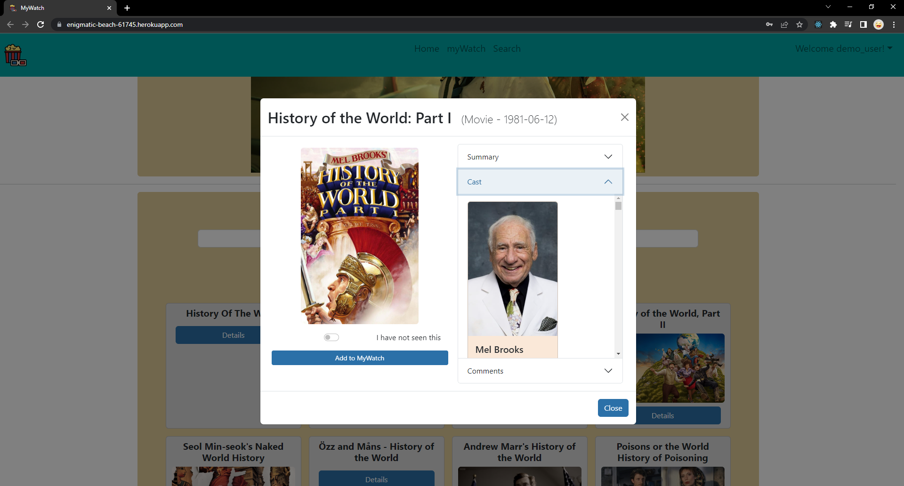

# Welcome to MyMovies - Read Me

This is a MERN Stack SPA where a user can keep track of movies they want to watch. First time users are able to sign up and existing users can login.  Users can search for movies and see a list of results.  Users can click on a search result for additional information and to add the selected movie to their 'MyMovies" list.  Users are able to view their "MyMovies" and remove from movies from thier list after watching. 

## Screen Shots

- Sign Up Page

- Login Page

- Landing Page

- Search Page

- MyWatch - Watched Items

- MyWatch - Need to Watch

- MyWatch - myActors

- Selected Item

- Selected Actor

- Leave a comment

- Optimized for Mobile veiwing

## Technologies Used
- Mongoose
- MongoDB
- Express
- React
- Node.js
- Bootstrap
- HTML5
- CSS 3
- JavaScript ES6
- Microsoft Paint 

- [The Movie Data Base(TMDB)](https://www.themoviedb.org/)

This project was bootstrapped with [Create React App](https://github.com/facebook/create-react-app).

## Getting Started

 - Search for a movie, tv show, or actor.  
 - click details for more information and add to myWatch.
    - view summary, cast, and comments
- Within myWatch section, click on details for more info or remove to remove from myWatch

## [Link to Deployed App](https://enigmatic-beach-61745.herokuapp.com/)
- use demo account or create your own
    - user email: demo@user.com
    - password: 12345

## Future Improvements

- add ratings to movies/shows
- add sorting options to myWatch and Search pages